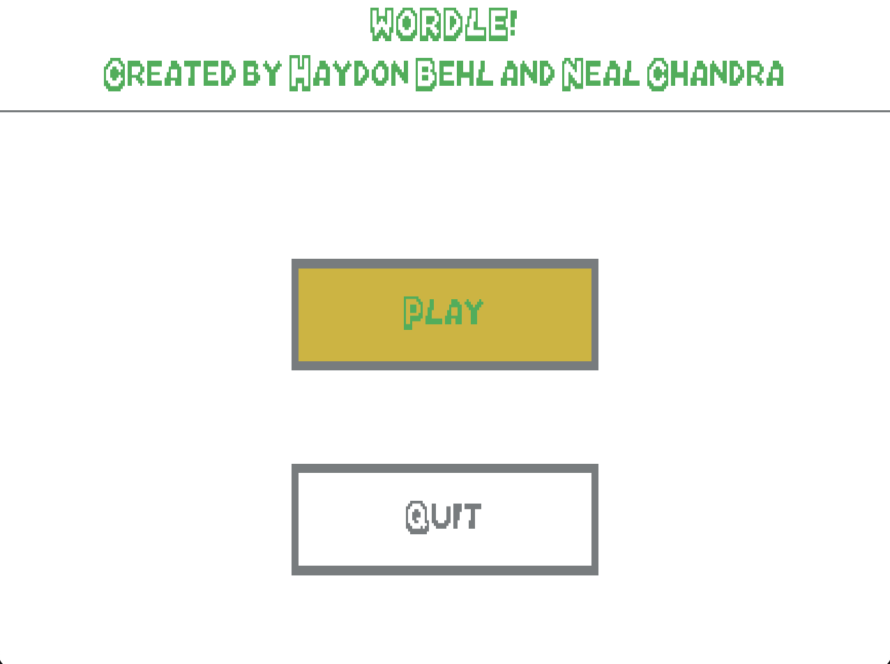
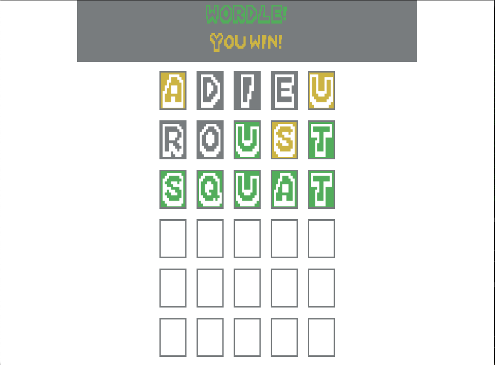
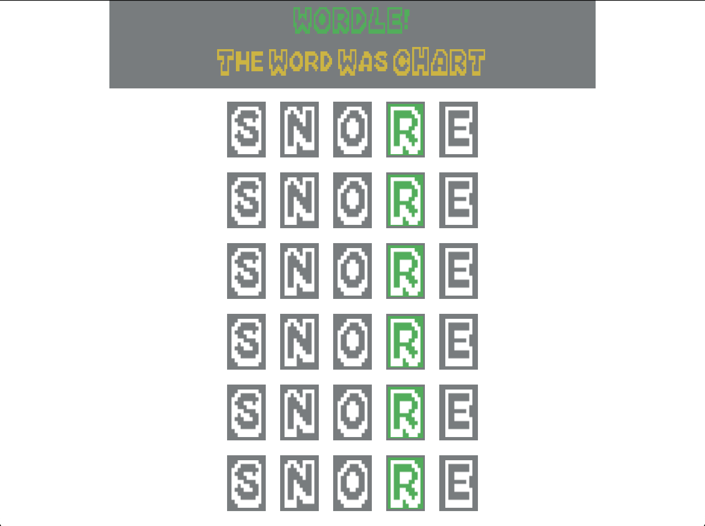

CMPE 126 Lab Project '23  

Authors
> Haydon Behl  
> Neal Chandra

CMake Build/Run Instructions
> cmake . -G "MinGW Makefiles"  
> make  
> ./cmpe126project

Build/Run Notes:
> Tested CMAKE generators: "MinGW Makefiles"  
> Executable target: "cmpe126project"

Ingame Screenshots  
  
  
  